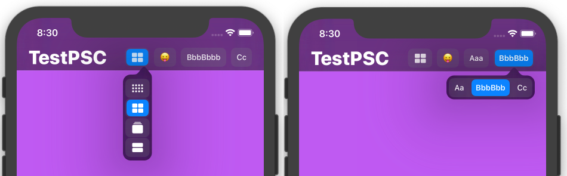

# PopupSegmentedControl

a subclass of UISegmentedControl that only shows the currently selected item, and lets the user change the currently selected item in a popup window on `iOS`. on `tvOS` the SegmentedControl will grow/shrink.

the main use for this controll is in a `UIBarButtonItem` in a `UINavigationBar` or a `UIToolBar`

if you pass UISegmentedControlNoSegment as the index to setImage/Title:forSegmentAtIndex: you can change the item that is displayed instead of the currently selected item.

By default `PopupSegmentedControl` will display a Horizontal popup, unless the items are wider than 50% of the screen, you can force a Vertical popup always by setting `UIViewAutoresizingFlexibleHeight`.

changing the list of items after init is currently not supported.

## Usage
1. Include PopupSegmentedControl.m and PopupSegmentedControl.h in your project.
2. Use `PopupSegmentedControl` in place of `UISegmentedControl` where you want some hot popup action.
3. Profit

